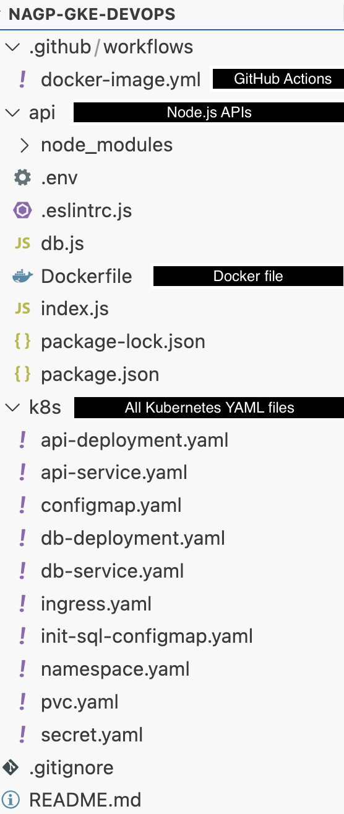

# 🚀 Node.js Microservice + PostgreSQL on GKE

Production-grade multi-tier Kubernetes application:
- Node.js microservice exposing an API
- PostgreSQL database with seeded data
- Deployed to GKE with best practices:
  - ConfigMap & Secret
  - PVC for data persistence
  - Ingress for external access
  - Rolling updates for API
  - Namespace isolation

---

## 📦 **Project Structure**



---

## 🛠 **Tech Stack**

| Layer           | Tech                            |
|-----------------|---------------------------------:|
| Service API     | Node.js (Express)               |
| Database        | PostgreSQL                      |
| Container       | Docker                          |
| Orchestration   | Kubernetes (GKE)                |
| Config & secret | ConfigMap + Secret              |
| Persistence     | PVC                             |
| Ingress         | nginx-ingress / GKE Ingress     |
| Namespace       | `prod`                        |

---

## 🌐 **Links** (replace with your URLs)

| Item               | Link |
|-------------------:|--:|
| 📂 Code repository | https://github.com/boyspartye4/nagp-gke-devops |
| 🐙 Docker Hub      | https://hub.docker.com/repository/docker/printfworld/nagp-gke-devops-api/ |
| 🚀 API endpoint    | http://34.131.233.27/api/records |
| 📹 Demo video      | [Watch demo](#) |

---

## 🏗 **Deployment**

> Make sure you have Docker, kubectl and a GKE cluster ready.  
> Replace `yourdockerhubuser` and domain with actual values.

---

### ✅ 1. Build & push Docker image

From inside the `api/` folder:

```bash
cd api
docker build -t yourdockerhubuser/node-api:latest .
docker push yourdockerhubuser/node-api:latest
```

Also there is a github workflow being created to automate this.

### ✅ 2. Create namespace

```bash
kubectl apply -f k8s/namespace.yaml
```

### ✅ 3. 🚀 Deploy all Kubernetes resources inside namespace

```bash
kubectl apply -f k8s/configmap.yaml -n prod
kubectl apply -f k8s/secret.yaml -n prod
kubectl apply -f k8s/init-sql-configmap.yaml -n prod
kubectl apply -f k8s/pvc.yaml -n prod
kubectl apply -f k8s/db-deployment.yaml -n prod
kubectl apply -f k8s/db-service.yaml -n prod
kubectl apply -f k8s/api-deployment.yaml -n prod
kubectl apply -f k8s/api-service.yaml -n prod
kubectl apply -f k8s/ingress.yaml -n prod
```

### ✅ 4. Verify

```bash
kubectl get all -n prod
kubectl get ingress -n prod
```

## ✅ 5. Test API:

curl http://34.131.233.27/api/records

To add one more item in the DB
curl http://34.131.233.27/api/add?item=newItem

## ✅ Clean up

Delete everything:

```bash
kubectl delete namespace prod
---

## Future road map
- Automate kubernetes deployment
